# PlantUML Diagramming

Match the project's existing conventions. When uncertain, check for existing `.puml` files to infer the local style -- naming, layout direction, theme usage, and abstraction level. Check for shared includes (`!include`) or a project theme file. These defaults apply only when the project has no established convention.

## Never rules

These are unconditional. They prevent broken or unreadable diagrams regardless of project style.

- **Never omit `@startuml`/`@enduml` delimiters** -- PlantUML silently fails or produces garbage without them. Every `.puml` file must start with `@startuml` and end with `@enduml` (or the equivalent for the diagram type: `@startmindmap`/`@endmindmap`, `@startgantt`/`@endgantt`, etc.).

- **Never use cryptic abbreviations or internal codenames as labels** -- use plain English that any team member understands. `AuthSvc` means nothing to a product manager; `Authentication Service` does. Labels are for humans, not compilers.

- **Never create diagrams with more than ~15 elements without grouping/nesting** -- overcrowded diagrams defeat the purpose. Use `package`, `rectangle`, `node`, `cloud`, or `together` to group related elements. If you cannot group meaningfully, split into multiple diagrams.

- **Never use legacy `skinparam` when `<style>` blocks achieve the same result** -- `skinparam` is deprecated. Use CSS-like `<style>` blocks for all visual customization. The only exception: edge cases where `<style>` does not yet support a specific property.

- **Never hardcode colors inline on individual elements** -- use `<style>` blocks or themes for consistency. Inline colors (`#FF0000`) on individual elements create maintenance nightmares and visual inconsistency.

- **Never mix arrow direction keywords (`-up->`, `-down->`) with layout hacks** -- let PlantUML auto-layout first. Only add direction hints when the auto-layout result is genuinely unreadable. Overriding layout in multiple places creates conflicts that produce worse results than no hints at all.

- **Never use `autonumber` without explicit format** -- bare `autonumber` produces plain integers that add visual noise without aiding comprehension. Use a format string: `autonumber "<b>[000]"` or `autonumber 1 10 "<b>[00]"`.

- **Never omit participant declarations in sequence diagrams** -- undeclared participants render in source-order, which produces unpredictable layouts. Declare all participants at the top in the order you want them displayed.

- **Never write diagrams without a `title`** -- every diagram needs context for the reader. A diagram without a title is a screenshot without a caption.

## Audience and abstraction level

**Default to high-level, business-friendly diagrams.** The primary audience is non-technical team members and new joiners. Use business-friendly labels, simple relationships, and minimal jargon.

- Use full words: "Payment Service", not "PaySvc" or "pmtSvc"
- Show system boundaries and data flow, not implementation details
- Label arrows with business actions: "submits order", "sends notification"
- Omit method signatures, database column names, and class internals unless explicitly requested

**Only produce detailed/technical diagrams** (class diagrams with methods, database schemas, detailed state machines) when the user explicitly asks for a technical or detailed diagram. When in doubt, ask.

## Diagram type selection

| Scenario | Recommended Type | Why |
|----------|-----------------|-----|
| How systems or services interact over time | Sequence | Shows temporal ordering and message flow clearly |
| High-level system architecture or service boundaries | Component | Shows parts and their relationships without temporal ordering |
| Infrastructure and deployment topology | Deployment | Shows physical/cloud nodes and what runs where |
| Business process or workflow with decisions | Activity | Shows branching, parallel paths, and swimlanes |
| Object relationships and data modeling (technical) | Class | Shows inheritance, composition, and structure -- technical audiences only |
| Lifecycle of a single entity | State | Shows transitions and conditions for one stateful object |
| Feature scope or user goals | Use Case | Shows actors and what they can do at a glance |
| Brainstorming or knowledge structure | Mindmap | Non-linear, quick to create |
| Project timeline with dependencies | Gantt | Shows scheduling, milestones, and critical path |
| Work breakdown or deliverable hierarchy | WBS | Shows hierarchical decomposition of deliverables |
| Data relationships (technical) | ER (class with stereotypes) | Shows entities, attributes, and cardinality |

## Sequence diagrams

Sequence diagrams are the most common type. They show how components interact over time.

### Participants

Declare all participants at the top in display order. Use the right stereotype for each:

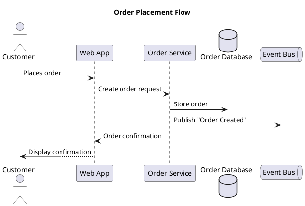

**Participant types:** `actor` (human user), `participant` (generic service), `boundary` (system edge/API gateway), `control` (orchestrator/coordinator), `entity` (domain object/data), `database` (data store), `queue` (message broker), `collections` (grouped instances).

### Arrows

| Syntax | Meaning |
|--------|---------|
| `->` | Synchronous request (solid line, filled arrow) |
| `-->` | Synchronous response (dashed line, filled arrow) |
| `->>` | Asynchronous message (solid line, open arrow) |
| `-->>` | Asynchronous response (dashed line, open arrow) |
| `->x` | Lost message (message that goes nowhere) |
| `<->` | Bidirectional |

### Activation and deactivation

Use `activate`/`deactivate` or the shorthand `++`/`--` to show when a participant is processing:

```plantuml
Web -> Orders ++: Create order
Orders -> DB ++: INSERT order
DB --> Orders --: OK
Orders --> Web --: Order ID
```

### Grouping

Use grouping to show conditional and repetitive flows:

```plantuml
alt Payment succeeds
    Orders -> Payments: Charge card
    Payments --> Orders: Success
else Payment fails
    Payments --> Orders: Declined
    Orders --> Web: Payment failed
end

opt Customer has loyalty account
    Orders -> Loyalty: Award points
end

loop For each item in cart
    Orders -> Inventory: Reserve stock
end

par Parallel notifications
    Orders ->> Email: Send confirmation
    Orders ->> SMS: Send text
end
```

### Notes, dividers, and delays

```plantuml
note right of Orders: Validates inventory\nbefore charging
note over Web, Orders: All communication over HTTPS

== Fulfillment Phase ==

...Warehouse picks and packs order...

Shipping -> Customer: Delivery notification
```

## Component and deployment diagrams

Use these for high-level system architecture. Focus on boundaries and data flow, not internals.

### Component diagram

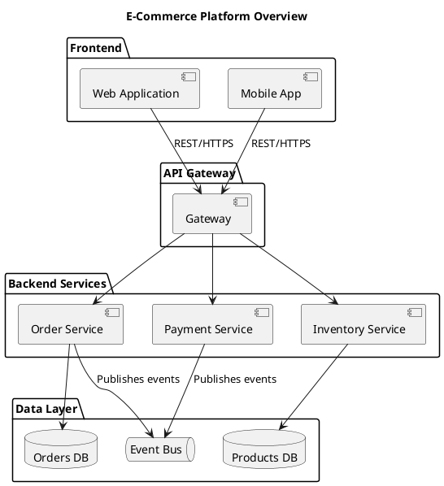

### Deployment diagram

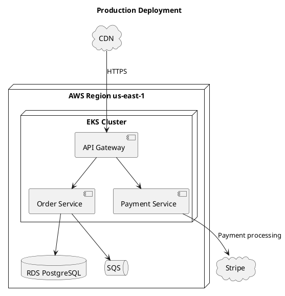

**Container types:** `node` (server/VM/container), `cloud` (external/cloud provider), `database` (data store), `package` (logical grouping), `rectangle` (generic boundary), `frame` (subsystem boundary).

Use `interface` or `()` for exposed ports:

```plantuml
() "REST API" as api
[Order Service] - api
```

## Activity diagrams

Use for business processes, workflows, and decision flows. Swimlane partitions make it clear who is responsible for each step.

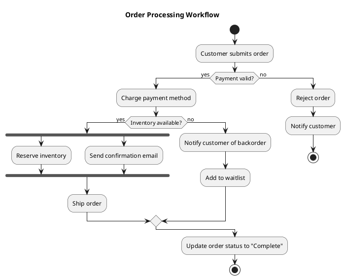

### Swimlanes with partitions

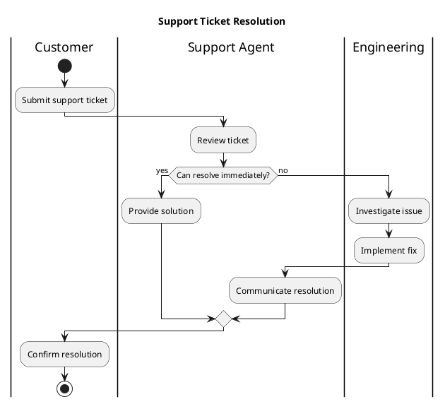

**Key syntax:** `start`/`stop`, `:action;`, `if (condition?) then (yes) else (no) endif`, `fork`/`fork again`/`end fork`, `|Swimlane|`, floating notes with `floating note right: text`.

## Class diagrams

**Technical diagrams only.** Use class diagrams when the user explicitly requests a technical or detailed diagram showing object relationships, inheritance, or data modeling.

### Relationships

| Syntax | Meaning | Use When |
|--------|---------|----------|
| `<\|--` | Extension/inheritance | "is a" relationship |
| `*--` | Composition | Part cannot exist without whole |
| `o--` | Aggregation | Part can exist independently |
| `-->` | Dependency | Uses temporarily |
| `--` | Association | General relationship |
| `..\|>` | Implements | Realizes an interface |

### Example

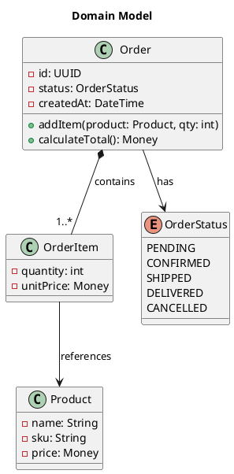

**Visibility modifiers:** `-` private, `+` public, `#` protected, `~` package-private.

**Stereotypes:** `<<interface>>`, `<<abstract>>`, `<<enum>>`, `<<service>>`, `<<entity>>`.

**Packages** group related classes:

```plantuml
package "Orders Domain" {
    class Order
    class OrderItem
}
```

## State diagrams

Use for modeling the lifecycle of a single entity -- orders, tickets, user accounts, deployments.

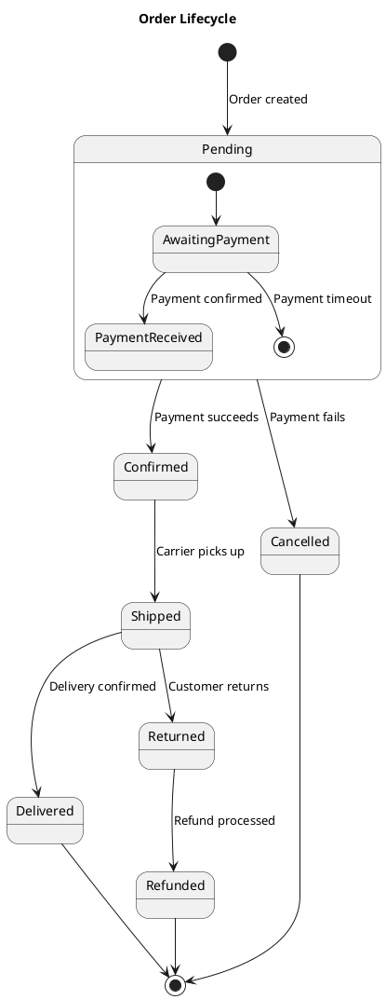

### Key syntax

- `[*]` -- initial and final pseudo-states
- `state Name { }` -- composite/nested states
- `state "Long Name" as alias` -- aliasing for readability
- `state fork_point <<fork>>` / `<<join>>` -- concurrent region fork/join
- `state choice_point <<choice>>` -- decision point

### Concurrent regions

```plantuml
state Processing {
    state "Verify Payment" as vp
    state "Check Inventory" as ci
    [*] --> vp
    [*] --> ci
    vp --> [*]
    ci --> [*]
    --
    state "Send Notification" as sn
    [*] --> sn
    sn --> [*]
}
```

## Other diagram types

### Use case diagram

Good for feature scope and actor interactions at a glance:

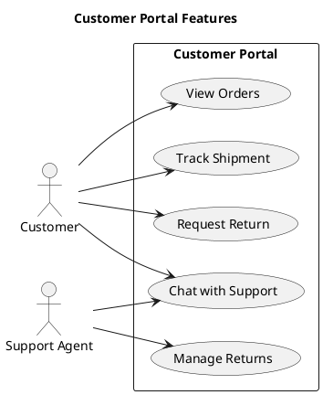

### Mindmap

Quick brainstorming or knowledge structure:

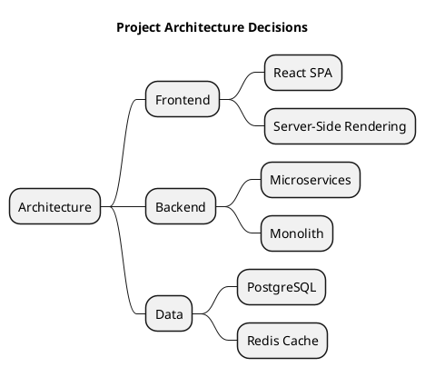

### Gantt chart

Project timelines with dependencies:

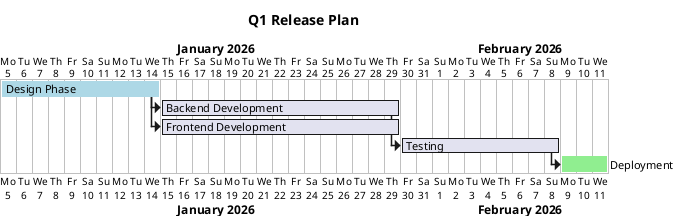

### WBS (Work Breakdown Structure)

Hierarchical deliverable decomposition:

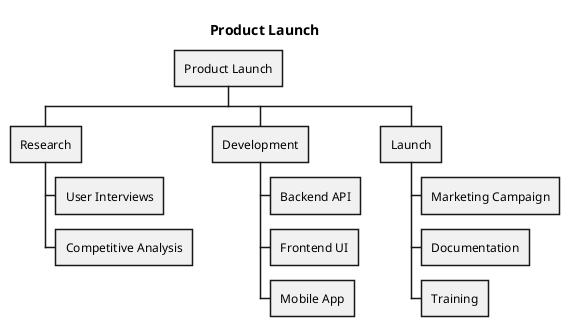

### ER diagram (using class diagram syntax)

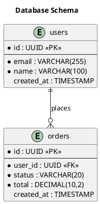

### JSON and YAML visualization

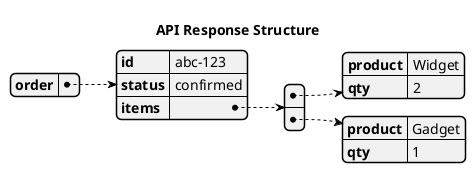

## Styling

### Modern `<style>` blocks (preferred)

Use CSS-like `<style>` blocks instead of legacy `skinparam`. Place the style block immediately after `@startuml`:

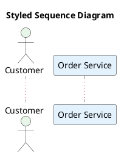

### Built-in themes

PlantUML ships with themes. Use `!theme` to apply one:

```plantuml
@startuml
!theme cerulean
title Themed Diagram
...
@enduml
```

Common themes: `cerulean`, `plain`, `sketchy-outline`, `aws-orange`, `mars`, `minty`. Preview themes before committing to one.

### Color formats

- Named colors: `Red`, `LightBlue`, `DarkGreen`
- Hex: `#FF5733`, `#2196F3`
- Gradients: `#White/#LightBlue` (top to bottom)

### Layout direction

Default is top-to-bottom. For wide diagrams with many horizontal relationships:

```plantuml
left to right direction
```

Add this immediately after `@startuml` (before any elements).

## Preprocessing

### !include

Split large diagrams or share common definitions across files:

```plantuml
!include common/styles.puml
!include common/actors.puml
```

Use relative paths. Keep shared definitions (themes, common participants, standard styles) in a `common/` or `shared/` directory.

### !procedure

Reusable diagram fragments:

```plantuml
!procedure $service($name, $alias)
    participant "$name" as $alias
!endprocedure

$service("Order Service", OS)
$service("Payment Service", PS)
```

### !function

Reusable computed values:

```plantuml
!function $endpoint($service, $path)
    !return $service + " " + $path
!endfunction
```

### Variables

```plantuml
!$primary_color = "#1565C0"
!$secondary_color = "#2E7D32"
```

### Conditionals and loops

```plantuml
!if (%getenv("DETAIL_LEVEL") == "high")
    class Order {
        - id: UUID
        - status: OrderStatus
        + addItem(product: Product, qty: int)
    }
!else
    rectangle "Order Service"
!endif

!$i = 0
!while ($i < 3)
    node "Worker $i"
    !$i = $i + 1
!endwhile
```

## Anti-patterns

- **Overcrowded diagrams without grouping** -- more than ~15 ungrouped elements makes the diagram unreadable. Split or group.
- **Technical jargon in business-level diagrams** -- `POST /api/v2/orders` belongs in API docs, not in a diagram for stakeholders. Use "Creates order" instead.
- **Mixing styling approaches** -- combining inline colors (`#Red`), `skinparam`, and `<style>` blocks in one file creates conflicting rules and unpredictable rendering. Pick one approach per file; prefer `<style>`.
- **Deep nesting beyond 3 levels in component diagrams** -- deeply nested `package` blocks produce tiny, illegible boxes. Flatten the hierarchy or split into separate diagrams.
- **Missing titles and legends** -- a diagram without a title is useless in a document with multiple diagrams. Add `title` always, `legend` when relationships need explanation.
- **Using class diagrams when a simpler type suffices** -- showing `Order -> PaymentService` as a class relationship when a component or sequence diagram communicates the same thing more clearly. Choose the simplest diagram type that conveys the information.
- **Duplicating diagram content instead of using `!include`** -- copy-pasted participant declarations and styles across multiple files drift out of sync. Extract shared definitions into include files.
- **Forcing layout with direction keywords everywhere** -- sprinkling `-up->`, `-left->`, `-right->` on every arrow fights the layout engine and usually produces worse results. Use them sparingly, only when auto-layout genuinely fails.
- **Bare `autonumber`** -- plain sequential integers (1, 2, 3...) on every arrow add clutter without meaning. Use formatted autonumber or omit it.
- **Undeclared participants** -- letting PlantUML infer participants from usage produces unstable ordering that changes when you add a new message.
